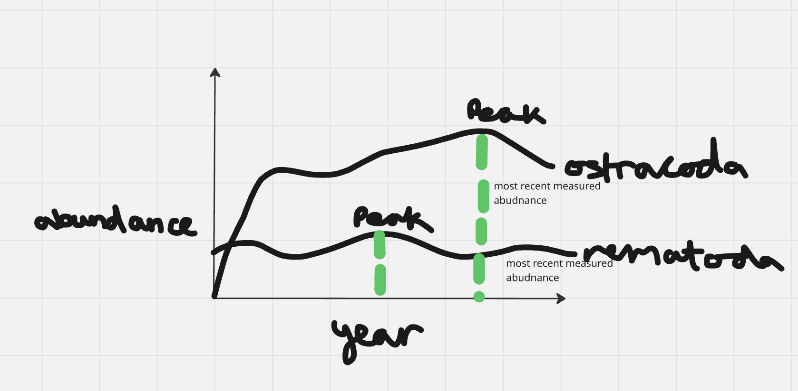

# Set up

## Packages

```{r}

# general use and cleaning
library(tidyverse)
library(here)
library(janitor)
library(snakecase)

# wrap axis labels
library(scales)

# reading .xlsx files 
library(readxl)

# visualise missing data 
library(naniar)

# arrange plots
library(patchwork)

# extra packages required for visualisation
library(ggtext)
library(showtext)
library(glue) 
```

## Data

```{r}
#| label: aq-invs-data

# taxonomic information
taxon_list <- read_csv(here("data", "taxon_list.csv")) 

# aquatic invertebrates
aq_ins <- read_xlsx(here("data", "Aquatic Sampling Data-2026-03-10.xlsx"),
                    sheet = "Aquatic Insects") 

# site information
sites <- read_xlsx(here("data", "Aquatic Sampling Data-2026-03-10.xlsx"),
                   sheet = "sites")

# water quality
water_quality <- read_xlsx(here("data", "Aquatic Sampling Data-2026-03-10.xlsx"),
                           sheet = "Water Quality",
                           na = c("", "n/a", "N/A", "over", "173+"))

```

```{r}
#| label: water-quality-cleaning

# creating new clean object from water quality
water_quality_clean <- water_quality |> 
  # clean column names
  clean_names() |> 
  # filtering join: only include sites in ncos_sites
  semi_join(sites, by = "site") |> 
  # create new column to join with later data frames
  unite("date_site", date, site, remove = TRUE) |> 
  # group by date_site column
  group_by(date_site) |> 
  # calculate median pH, salinity, DO
  summarize(med_ph = median(p_h, na.rm = TRUE),
            med_sal = median(salinity_ppt, na.rm = TRUE),
            med_do = median(dissolved_oxygen_mg_l, na.rm = TRUE)) |> 
  # ungroup data frame
  ungroup() |> 
  # filter out salinity outliers
  filter(date_site != "2022-08-12_NVBR") 
```

```{r}
#| label: cleaning-taxon-list

# creating new clean object from taxon_list
taxon_list_clean <- taxon_list |> 
  # converting taxon name to snake case (no spaces or capital letters,
  # only underscores)
  mutate(verbatim_name = to_any_case(verbatim_name, case = "snake"))
```

```{r}
#| label: cleaning-aq-ins

# creating new clean object from aquatic inverts
aq_ins_clean <- aq_ins |> 
  # clean column names
  clean_names() |> 
  # filtering join: only include sites occurring in ncos_sites
  semi_join(sites, by = c("site")) |> 
  # renaming columns
  rename(date = date_on_vial) |> 
  # select columns of interest
  select(date, sample_type, site,
         ostracod,
         copepod,
         hemiptera_corixidae_boatman,
         cladocera,
         nematode,
         diptera_ceratopogonidae, 
         annelida_oligochaete,
         diptera_chironomid,
         annelida_polychaete) |> 
  # filter to only include "filtered beaker" samples
  filter(sample_type %in% c("FB 250", "FB250")) |> 
  # convert the data frame to long format
  pivot_longer(cols = ostracod:annelida_polychaete,
               names_to = "taxon",
               values_to = "abundance") |> 
  # group by date, site, taxon
  group_by(date, site, taxon) |> 
  # calculate average abundance per liter (sum abundance divided by 7.5 liters)
  summarize(ave_lit = sum(abundance, na.rm = TRUE)/7.5) |> 
  # ungroup data frame
  ungroup() |> 
  # create a new column called `date_site` to join with water quality
  unite("date_site", date, site, remove = FALSE) |> 
  # join with water quality
  left_join(water_quality_clean, by = c("date_site")) |> 
  # join with taxon list
  left_join(taxon_list_clean, by = c("taxon" = "verbatim_name")) |> 
  # add full names of sites
  mutate(site_full = case_when(
    site == "NVBR" ~ "North of Venoco Bridge",
    site == "NEC" ~ "South of Venoco Bridge",
    site == "NMC" ~ "Main Channel",
    site == "NPB" ~ "South of Phelps Bridge",
    site == "NPB1" ~ "North of Phelps Bridge",
    site == "NPB2" ~ "Phelps Road",
    site == "NWP" ~  "West Pond",
    site == "NDC" ~ "Devereux Creek"
  )) |> 
  # setting factor levels for site
  mutate(site_full = fct_reorder(site_full, med_sal, .fun = "median", .na_rm = TRUE),
         site_full = fct_rev(site_full))
```

```{r}
#| label: wrangling-aq_ins_clean-to-logsalinity2


# new object created from aq_ins_clean
logsalinity2 <- aq_ins_clean |>
  # log + 1 transform mean abundance/liter
  mutate(log_ave_lit = log(ave_lit + 1))

slice_sample(logsalinity2)

```

# 1. Explain your inspiration

Which visualization you chose for your inspiration?
- I chose Steven Ponce’s “Coal falls. Renewables rise.”

Why it makes sense for your dataset of choice?
- It makes sense as it shows how the abundance of 2 different aquatic invertebrates change through time.

which variables from your dataset will be shown in your visualization, and what visual components they map onto (axes, shapes, colors, etc.)
- x-axis will be the date (year)
- y-axis will be the abundance (log transformed average abundance per liter)
- I will use points and lines (line graph) to show how the 2 taxons increase or decrease in abundance over time. I am choosing the taxon ostracoda and nematoda
- I will also show when their abundance peaks
_ I will use the same colours as the inspiration

# 2. Plan your figure



# 3. Code your figure